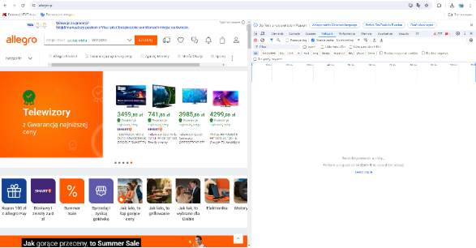
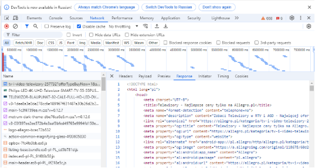
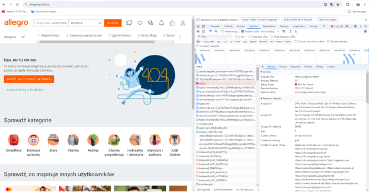
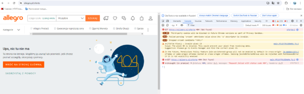
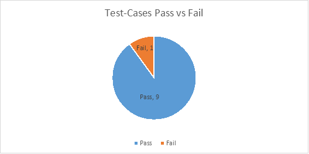

1. An application for analyzing and testing browser-server networking: 

   <https://allegro.pl/>

2. Started DevTools, using Chrome browser, Version 126.0.6478.182 (Official build), (64 bit), went to the Network tab:

   

3. **Interception of network traffic:**

   Clicking on the offer “Telewizory z Gwarancją najniższej ceny” leads to the formation of a browser request to the resource, the server responds with HTML code of a new page and additional requests for downloading images, CSS, scripts, sending statistics are sequentially executed. No requests rejected, not processed and containing error status codes were found

4. **Analyzing requests and responses:**

   Requesting a new HTML page

|Type:|Document|
| :- | :- |
|Request URL:|https://allegro.pl/kategoria/tv-i-video-telewizory-257732?offerTypeBuyNow=1&stan=nowe&vat\_invoice=1&BEST\_PRICE\_GUARANTEE=1|
|Method:|GET|
|Status Code/Text:|200 OK|
|Response Content-Type:|text/html; charset=utf-8|

Server response - new HTML page, its active and passive content, stylesheets, statistics - by subsequent requests generated in the process of HTML page code processing by the browser.

5. **Checking errors in network requests:**

   “Console” tab - no records of errors in sending requests or failures in receiving responses were found.

   “Network” tab - no status codes of errors in processing requests (4xx, 5xx), no failures in sending requests or unprocessed requests.

   To check the processing of erroneous requests by the server, I enter the following URL into the address bar of the browser: https://allegro.pl/oferta. The browser executes the request to the specified address with the content of the request header 

   Accept:text/html,application/xhtml+xml,application/xml;q=0.9,image/avif,image/webp,image/apng,\*/\*;q=0.8,application/signed-exchange;v=b3;q=0.7 

   and receives a response from the server in the form of an HTML document with the status code 404 Not Found:

|Type:|Document|
| :- | :- |
|Request URL:|https://allegro.pl/oferta|
|Method:|GET|
|Status Code/Text:|404 Not Found|
|Response Content-Type:|text/html; charset=utf-8|

In the body of the response - HTML document containing a page with information for the user about the absence of this resource

On the “Console” tab - records about errors of processing the specified request:

6. **Testing asynchronous requests:**

   After processing the resource request: https://allegro.pl/kategoria/tv-i-video-telewizory-257732?offerTypeBuyNow=1&stan=nowe&vat\_invoice=1&BEST\_PRICE\_GUARANTEE=1 and loading the HTML document with the content of the corresponding page, an asynchronous:

   - XHR request the response to which creates a pop-up active window with a user survey:

|Type:|xhr|
| :- | :- |
|Request URL:|https://edge.allegro.pl/preferences?name=surveySent|
|Method:|GET|
|Status Code/Text:|200 OK|
|Response Content-Type:|application/vnd.allegro.internal.v1+json|

` `- Preflight request within the Cross-Origin Resource Sharing (CORS) mechanism - answer methods that can be used in forming requests and constraints:

|Type:|preflight|
| :- | :- |
|Request URL:|https://edge.allegro.pl/surveys/873a8667-9446-4826-9c34-c27f71f05355/answers|
|Method:|OPTIONS|
|Status Code/Text:|204 No Content|
|Response Headers:||
|Access-Control-Allow-Credentials:|true|
|Access-Control-Allow-Headers:|content-type|
|Access-Control-Allow-Methods:|POST, OPTIONS|
|Access-Control-Allow-Origin:|https://allegro.pl|

- After checking the “8” checkbox on the questionnaire and clicking the “Submit” button, an xhr request is made to edge.allegro.pl with the survey result data in the body and Origin: https://allegro.pl in the request headers

|Type:|xhr|
| :- | :- |
|Request URL:|https://edge.allegro.pl/surveys/873a8667-9446-4826-9c34-c27f71f05355/answers|
|Method:|POST|
|Status Code/Text:|201 Created|
|Request Body:|
{surveyVersionId: "98cb7afa-b769-4028-afbe-fbf15596955d",…}

` `answers: [{type: "CLOSED", questionId: "M\_t2d7h4SHUyMd4sztVP9", order: 8, answerId: "r959xQHsToQ73XY8nYPLa"},…]

`  `0: {type: "CLOSED", questionId: "M\_t2d7h4SHUyMd4sztVP9", order: 8, answerId: "r959xQHsToQ73XY8nYPLa"}

`    `answerId: "r959xQHsToQ73XY8nYPLa"

`    `order: 8

`    `questionId: "M\_t2d7h4SHUyMd4sztVP9"

`    `type: "CLOSED"

`   `1: {type: "CLOSED", questionId: "XC8NC6XDkf5Sk-xmhrun-", order: 10, answerId: "sXKfSVjsfQvbyofEgidzR"}

`  `metadata: {BEST\_PRICE\_GUARANTEE: "1", offerTypeBuyNow: "1", stan: "nowe", vat\_invoice: "1",…}

` `surveyVersionId: "98cb7afa-b769-4028-afbe-fbf15596955d"

` `surveyVisitId: "8f6980e5-93f8-4264-b197-539f57eaf074"
|

Asynchronous requests are transmitted and handled correctly by the server.

7. **Editing requests:**

   I check the server processing of the edited request on the basis of xhr request “verification”, which is created by the browser as a result of filling in the phone number in the user authorization form using this number and pressing the send button:

|Type:|xhr|
| :- | :- |
|Request URL:|https://edge.allegro.pl/authentication/phone-number/web/number/verification|
|Method:|POST|
|Status Code/Text:|200 OK|
|Request Body:|
{phoneNumber: "+48459532256", originUrl: "/"}

originUrl: "/"

phoneNumber: "+48459532256"
|

I perform phone number replacement, for this I copy the “verification” request as fetch and paste it in the Console tab after await:

|Request fetch|
await fetch("https://edge.allegro.pl/authentication/phone-number/web/number/verification", {

`  `"headers": {

`    `"accept": "application/json",

`    `"accept-language": "pl-PL",

`    `"cache-control": "no-cache",

`    `"content-type": "application/json",

`    `"pragma": "no-cache",

`    `"priority": "u=1, i",

`    `"sec-ch-ua": "\"Not/A)Brand\";v=\"8\", \"Chromium\";v=\"126\", \"Google Chrome\";v=\"126\"",

`    `"sec-ch-ua-mobile": "?0",

`    `"sec-ch-ua-platform": "\"Windows\"",

`    `"sec-fetch-dest": "empty",

`    `"sec-fetch-mode": "cors",

`    `"sec-fetch-site": "same-site",

`    `"x-authentication-tab-id": "6ac399a8-0531-4745-b751-33f273376aa0"

`  `},

`  `"referrer": "https://allegro.pl/",

`  `"referrerPolicy": "strict-origin-when-cross-origin",

`  `"body": "{\"phoneNumber\":\"+48165216521321\",\"originUrl\":\"/\"}",

`  `"method": "POST",

`  `"mode": "cors",

`  `"credentials": "include"

});
|
| :- | :- |

I replace the number in the body of the request with a non-valid value (the number of digits in the number is 3 more than in the real number) and execute the request:

|Type:|xhr|
| :- | :- |
|Request URL:|https://edge.allegro.pl/authentication/phone-number/web/number/verification|
|Method:|POST|
|Status Code/Text:|200 OK|
|Response Body:|
{

`    `"result": "INVALID\_PHONE\_NUMBER",

`    `"resultDescription": "Numer telefonu jest nieprawidłowy",

`    `"normalizedPhoneNumber": null,

`    `"redirectUrl": null

}
|

The server processes the request and sends a response containing the message INVALID\_PHONE\_NUMBER and a text message for the user, which will be displayed in the authorization form: “Numer telefonu jest nieprawidłowy”.

I repeat the above steps, replacing the phone number with +48000000000:

|Type:|xhr|
| :- | :- |
|Request URL:|https://edge.allegro.pl/authentication/phone-number/web/number/verification|
|Method:|POST|
|Status Code/Text:|200 OK|
|Request Body:|
{

`    `"result": "SUCCESS",

`    `"resultDescription": "Udało się!",

`    `"normalizedPhoneNumber": "+48 000000000",

`    `"redirectUrl": null

}
|

The server processes the request and sends a response in the body of which does not contain a message about an error in the number, which will cause further interaction attempt to send SMS with the code for authorization. I consider the processing of the request by the server to be erroneous - register the bug.

8. **Bug Report**

<table><tr><th colspan="3" valign="bottom"><b>Bug report</b></th></tr>
<tr><td colspan="1" rowspan="6"><b>1.1</b></td><td colspan="1"><b>Bug</b></td><td colspan="1">Server does not process zero phone number in the authorization form as invalid</td></tr>
<tr><td colspan="1"><b>Severity</b></td><td colspan="1">Minor</td></tr>
<tr><td colspan="1"><b>Script Content</b></td><td colspan="1">
1\. Open https://allegro.pl

2\. Open DevTools

3\. Create Request:

fetch("https://edge.allegro.pl/authentication/phone-number/web/number/verification", {

`  `"headers": {

`    `"accept": "application/json",

`    `"accept-language": "pl-PL",

`    `"cache-control": "no-cache",

`    `"content-type": "application/json",

`    `"pragma": "no-cache",

`    `"priority": "u=1, i",

`    `"sec-ch-ua": "\"Not/A)Brand\";v=\"8\", \"Chromium\";v=\"126\", \"Google Chrome\";v=\"126\"",

`    `"sec-ch-ua-mobile": "?0",

`    `"sec-ch-ua-platform": "\"Windows\"",

`    `"sec-fetch-dest": "empty",

`    `"sec-fetch-mode": "cors",

`    `"sec-fetch-site": "same-site",

`    `"x-authentication-tab-id": "6ac399a8-0531-4745-b751-33f273376aa0"

`  `},

`  `"referrer": "https://allegro.pl/",

`  `"referrerPolicy": "strict-origin-when-cross-origin",

`  `"body": "{\"phoneNumber\":\"+48000000000\",\"originUrl\":\"/\"}",

`  `"method": "POST",

`  `"mode": "cors",

`  `"credentials": "include"

});
</td></tr>
<tr><td colspan="1"><b>Check</b></td><td colspan="1">
Response Body:

{

`    `"result": "INVALID_PHONE_NUMBER",

`    `"resultDescription": "Numer telefonu jest nieprawidłowy",

`    `"normalizedPhoneNumber": null,

`    `"redirectUrl": null

}
</td></tr>
<tr><td colspan="1"><b>Actual result</b></td><td colspan="1">
Response Body:

{

`    `"result": "SUCCESS",

`    `"resultDescription": "Udało się!",

`    `"normalizedPhoneNumber": "+48 000000000",

`    `"redirectUrl": null

}
</td></tr>
<tr><td colspan="1"><b>Environment</b></td><td colspan="1">
Windows 10 Pro 21H2

Chrome Version 126.0.6478.182 (Official build), (64 bit)
</td></tr>
</table>

9. **Test report.**

1. **Purpose of the document:** 

   This document explains the actions performed within the framework of testing the network interaction with https://allegro.pl server, the results obtained, their statistics and contains recommendations for improvement.

2. **Site overview:**

   The website https://allegro.pl is an e-commerce platform that supports both auctions and direct sales. It connects buyers with individual sellers and businesses. Features: - user accounts: registered users can track their purchases, save favorite items and receive notifications of deals and discounts; - product and category search; - shopping cart and checkout; - various payment methods, including bank transfers, credit/debit cards and e-wallets; - shipping and self-delivery.

3. **Testing area:**

   Processing by the web server of the site of browser requests to the resources of the site in accordance with use cases within the smoke tasting.

4. **Metrics:**

   |**Test-cases planned**|**Test-cases executed**|**TCs Pass**|**TCs Failed**|
   | :-: | :-: | :-: | :-: |
   |10|10|9|1|

   

5. **Test cases passed in the course of testing:**

|**№ Test Case**|**Name of check**|**Result**|**Comments and recommendations**|
| :-: | :-: | :-: | :-: |
|1\.1|Requests for displaying the main page of the site by the browser and loading the results of their processing by the server are performed correctly|Pass||
|1\.2|Queries and downloading the results of their processing when going to other pages via links of the main page are performed correctly|Pass||
|1\.3|There are no status codes, status-text and error logs when the server processes requests|Pass||
|1\.4|A request for a non-existent resource is processed correctly by the server, information to the user about the cause of the error is passed to the frontend|Pass||
|1\.5|Asynchronous requests are transmitted and processed correctly by the server|Pass||
|1\.6|Preflight requests within CORS when sending user data are processed correctly, the following requests with data are not blocked|Pass||
|1\.7|A request containing data for user authorization by phone number with valid data is processed correctly by the server|Pass||
|1\.8|A request containing data for user authorization by phone number is processed correctly by the server if the number of digits in the number is exceeded, an error message is sent to the frontend|Pass||
|1\.9|A request containing data for user authorization by phone number for a number consisting of a country code and all “0” is processed correctly by the server, an error message is sent to the frontend|Fail|The request is processed by the server as containing valid data. The response does not contain information about an error in the number. SMS sending to the “zero” number is initialized|
|1\.10|Queries when entering each character in the search field of the site are processed correctly by the server, the response contains data with recommendations for the user|Pass||

6. **Team composition and scope of work:**

Testing was conducted by the team - 1 Junior QA, 10 test cases were conducted, testing time - 1 hour.

7. **Conclusions from the test results:**

During the test period 10 test cases were conducted, 1 defect was detected. The list of defects is given in Appendix 1. It is recommended to enter the mask of “zero” phone number (country code + all zeros in the number) as non-valid with sending the corresponding information to the frontend and blocking the initialization of SMS sending.

**Appendix 1**

**List of defects**

|**№**|**№ Test Case**|**Short description**|**Status**|**Severity**|
| :-: | :-: | :-: | :-: | :-: |
|1|1\.9|Request containing data for user authorization by phone number for the number consisting of country code and all “0”.|Submitted|Minor|

